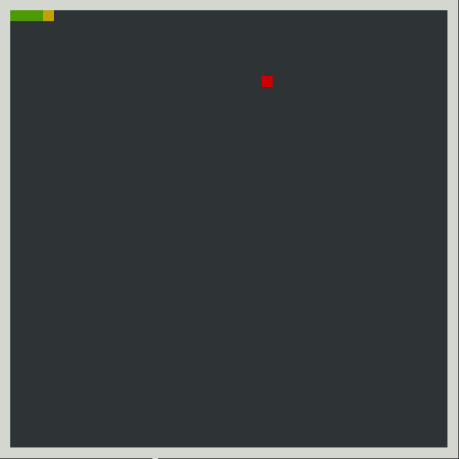
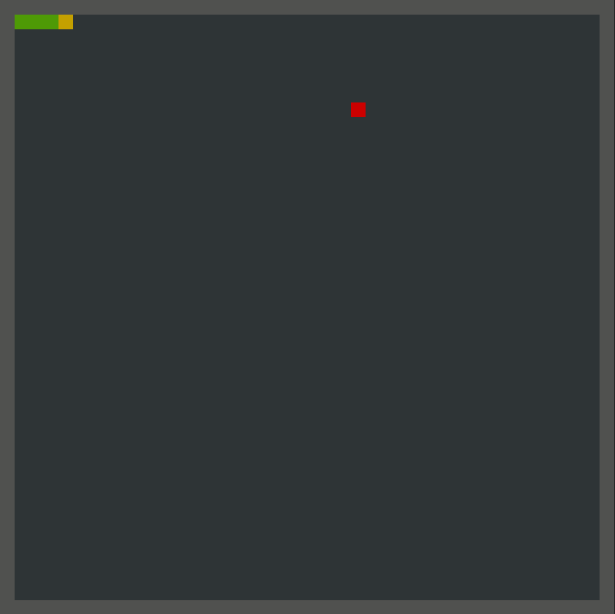
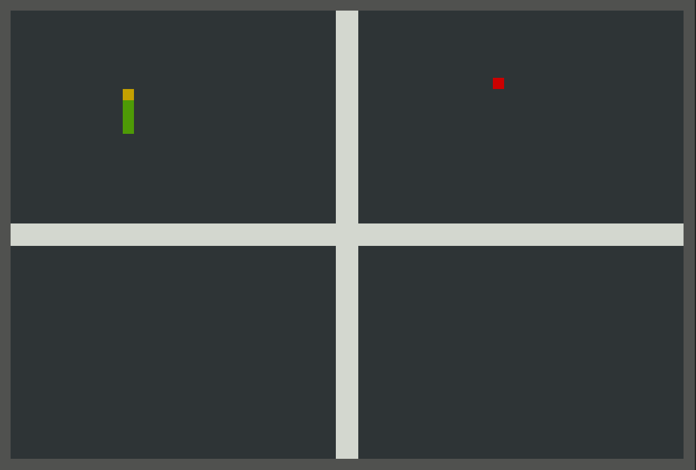

# Snake

Welcome to the game of Snake!

## Controls

- `w` - move up
- `s` - move down
- `a` - move left
- `d` - move right
- `x` - quit game

## Maps

1. First map: 

2. Second map:

3. Third map:

## How to create your own map

In `.txt` files we store information about field parameters such as *field size*, *walls transparency* and etc.

1. `x` `y` - field sizes, firstly comes *x*, then *y*
2. `walls` - parameter which determines if snake will go through edge walls
3. `x_head` `y_head` - initial direction of snake, firstly comes *x* axis, then *y* axis
4. `size` - initial snake size
5. `Point[size]` - an array of snake points, starting with tail and ending with head, each point starts with *x* coordinate and ends with *y* coordinate
6. `field[y][x]` - an array which determines field space such as walls

If you find any issue - please create issue at issues tab! Also if you want to see your map in the game - create pull request and we will think about adding it to the game.